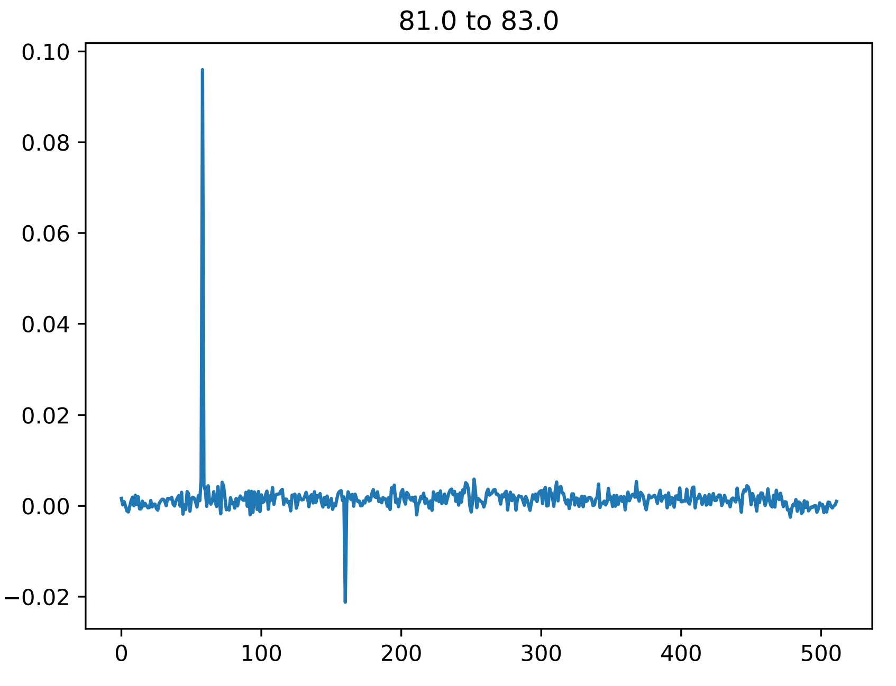
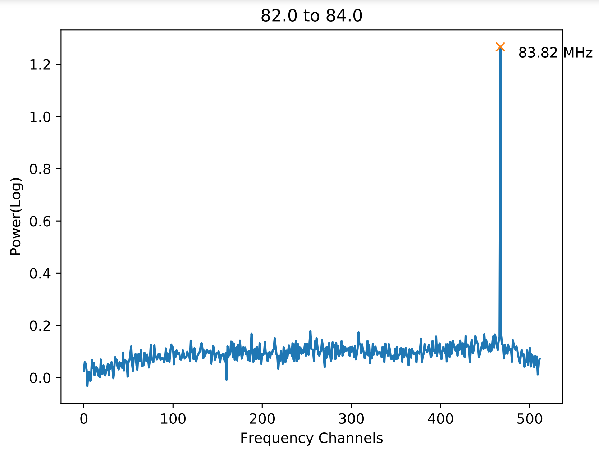
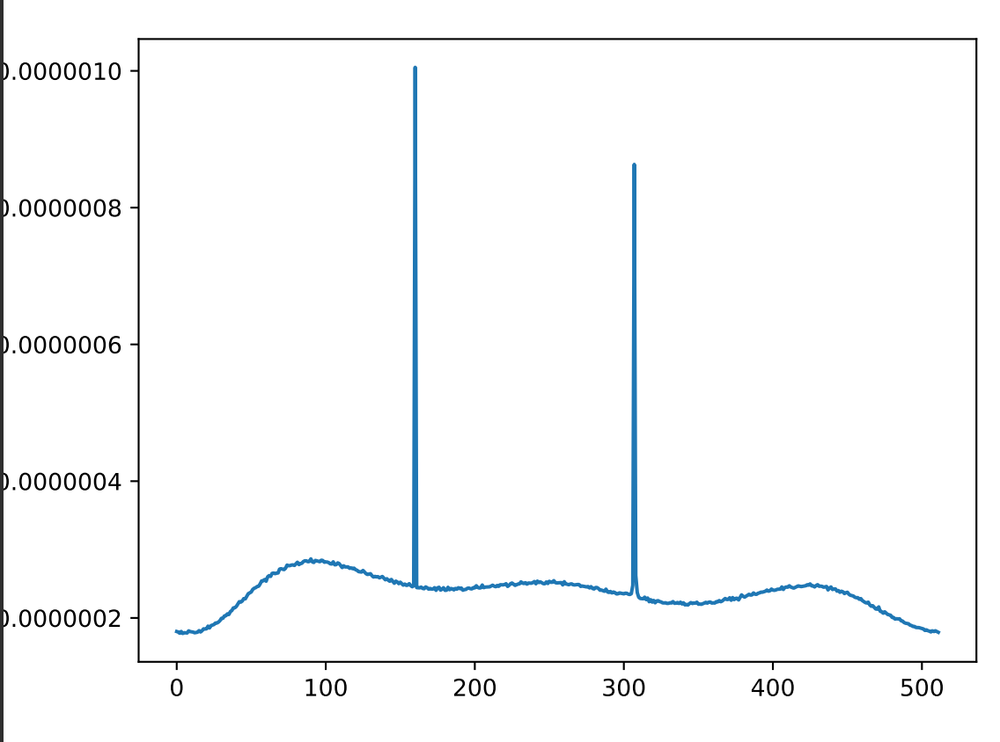
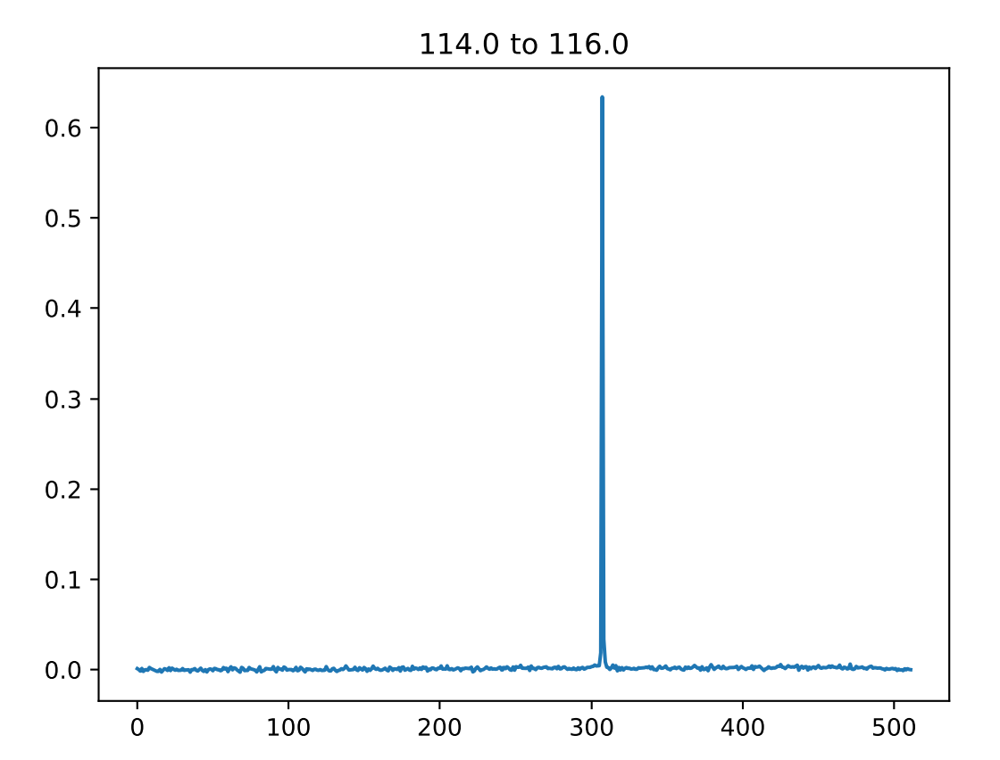
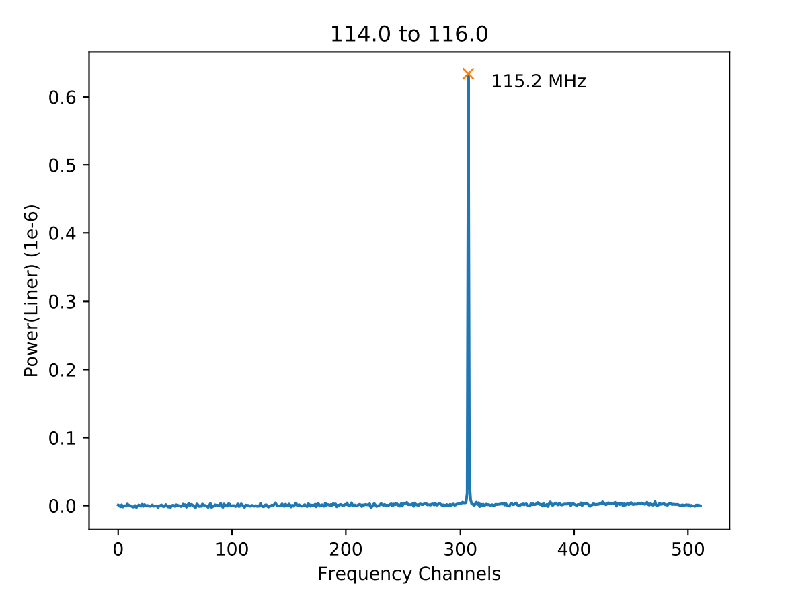

===============================================
Radio-Frequency-Interference Scan at APD, SVNIT
===============================================

Observations
------------

+-------------------------+--------------+--------------+
| **Observation**         | **obs date** | **obs time** |
+-------------------------+--------------+--------------+
| First Light (FL)        | 26-08-2019   | 13:33        |
+-------------------------+--------------+--------------+
| Second Thought (ST)     | 26-08-2019   | 18:42        |
+-------------------------+--------------+--------------+
| Third Bird (THV)        | 30-08-2019   | 18:00        |
+-------------------------+--------------+--------------+
| Fourth HomeRun (FHR)    | 31-08-2019   | 23:04        |
+-------------------------+--------------+--------------+
| Fifth Height (FH)       | 02-09-2019   | 07:47        |
+-------------------------+--------------+--------------+
| Sixth Kite (SK)         | 02-09-2019   | 08:29        |
+-------------------------+--------------+--------------+
| Seventh Path (SP)       | 03-09-2019   | 18:35        |
+-------------------------+--------------+--------------+
| Eight Voyager(s)        | 03-09-2019   | 19:04        |
+-------------------------+--------------+--------------+
| Ninth Cloud (NC)        | 06-09-2019   | 17:38        |
+-------------------------+--------------+--------------+
| Tenth Wind (TW)         | 06-09-2019   | 23:41        |
+-------------------------+--------------+--------------+
| Eleventh Thunder (ET)   | 07-09-2019   | 02:53        |
+-------------------------+--------------+--------------+
| Twelfth Chandryaan (TC) | 07-09-2019   | 04:28        |
+-------------------------+--------------+--------------+
| Thirteenth Clue (ThC)   | 07-09-2019   | 06:26        |
+-------------------------+--------------+--------------+

Methodology
-----------

The run was conducted from ``80 MHz`` to ``300 MHz`` with ``2 MHz`` bandwidth and ``1 MHz`` overlap, at Applied Physics Department, SVNIT, Surat.

The idea was to remove the initial noise floor of the SDR(Johnson's Noise) from the data to obtain a clean spectrum of RFIs; of course, due to limited noise data and the variability of environmental factors, the noise floor captured had inherent flaws, but since we were more interested in obtaining a relative radio frequency spectrum, the flaws are present as artifacts should be disregarded.

The captured noise floor of the ``SDR``:

The ``X-Axis`` denotes ``Frequency channels`` and ``Y-Axis`` denotes ``Relative Power(Linear)``.

.. note::

    SAS supports both ``linear`` and ``logarithmic`` acquisation.

The data after removal of noise looks like:
(example from ``First Light``) 

    
Due to the scaling of the graph, the noise is not particularly visible, but when we look at something in which the peak is only slightly higher than the noise floor, like:

Then the distinction between the actual RFI and the Noise Floor becomes challenging to make, here we can make use of our Noise Floor data, after removing NF, the obtained spectrum looks like:
The absolute value of power is of less importance than the relative power for us here.

And, finally on using the ``peak finder`` program, the result obtained are:

Credits
-------

Data acquired using SAS_ which internally uses rtl-power-fftw_.

.. _SAS: https://github.com/devanshshukla99/SAS
.. _rtl-power-fftw: https://github.com/AD-Vega/rtl-power-fftw
